> **Completed for MOBI3002: Mobile Application Development Final Project**
>
> Lauren MacDonald, December 2023
>
> **Languages/Concepts**: Kotlin, Compose, RESTful API

## Weather Application
This app was built using Kotlin, Compose in Android Studio. weatherapi.com is used to pull weather
data for the current forecast and 3 day forecast. The user's latitude and longitude are accessed
and used to supply the API URL parameter required to access weather data for the area. The ROBOPOJO 
plugin was used, along with the RetroFit library to handle the API request. Navigation Controller 
is used to navigate between the two screens in the app.

### Light Screenshots

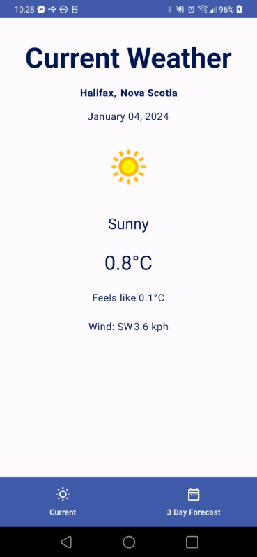
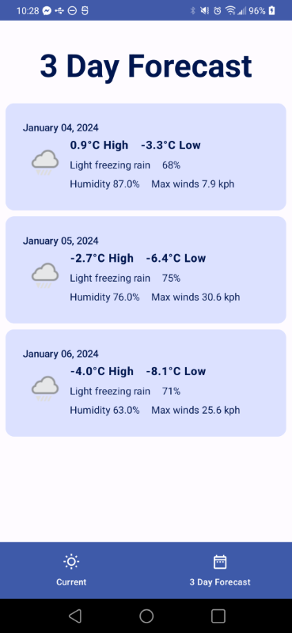

### Dark Screenshots

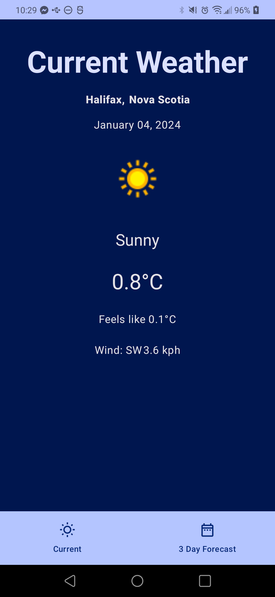
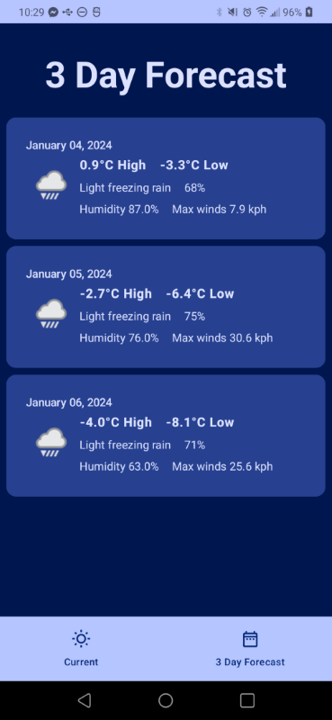

> **Current To Dos:**
> - Add in functionality to handle when user denies location permissions
> - Fix bug for those who do not have constant location tracking on. Currently the app accesses the 
>   last known location, which can be null. If it is null, on the first launch the app will not display
>   anything unless the user closes and re-opens the app.
> - Round the numbers to no decimal places.

## Details
### RoboPOJOGenerator and Model

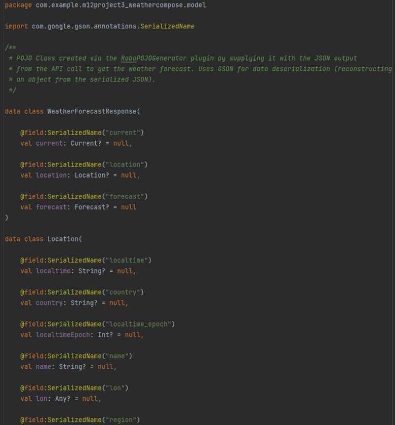

RoboPOJOGenerator plugin was used to create a POJO class based off of the JSON provided. This was used
to create a POJO class for the weather API response for the WeatherForecastResponse Model.

### Weather API Data

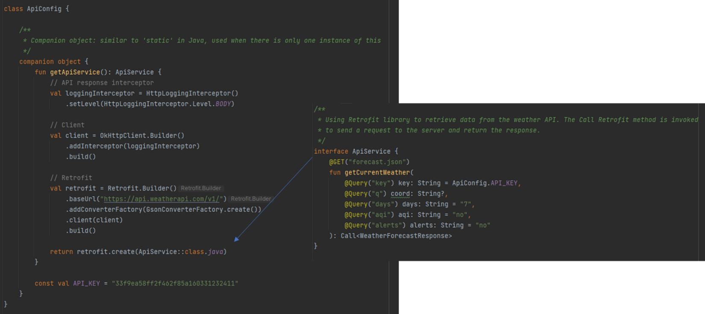

The RetroFit library was used to retrieve data from the weather API. The ApiConfig file uses the ApiService
interface to send a request to the server and return a response.

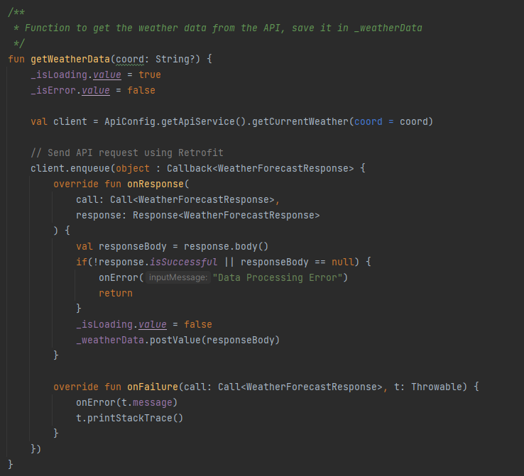

The MainViewModel class uses the API classes and functions to retrieve the data from the API response 
and store it in a LiveData<WeatherForecastResponse> object to be used in the app. The above screenshot
is of the getWeatherData function, which takes the coordinates from the location permissions to supply the
API URL.

### User Interface

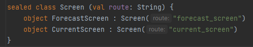

**screen.kt** holds a sealed class called Screen, which takes a String as a parameter to define the route 
for the navigation in the app. There are two screens, one for current weather and 3 day forecast.

The **Navigation.kt** file is responsible for navigation in the app and putting the UI together. It 
uses a nav controller to control the navigation, taking the screen sealed class to route it. There is 
a bottom navigation bar to move between the two screens, whose layouts are also defined in this file 
using Composables.

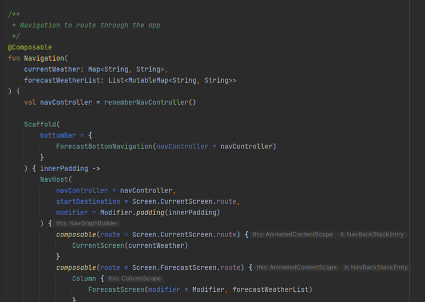

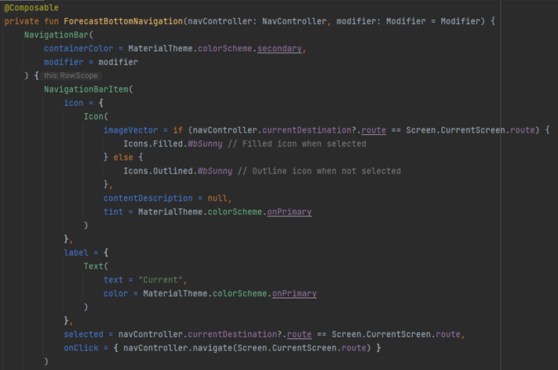

Part of the set up for creating the bottom navigation bar.

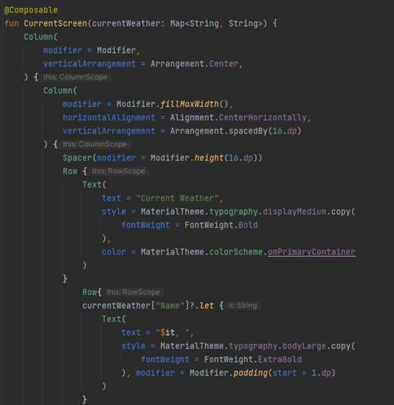

Composable portion for the CurrentScreen, takes a Map<String, String> for the current weather data.

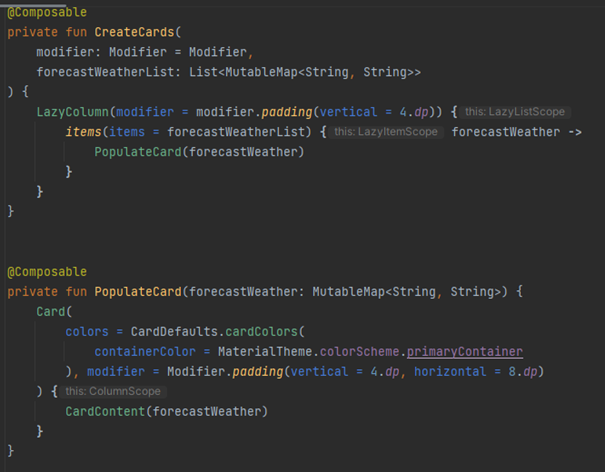

Composables for the forecast weather. The forecast weather is stored as a List of MutableMap<String, String>.
The cards are populated using the PopulateCard function and called in the CreateCards function.

### Main Activity
This class is where the location is accessed and the rest of the app is pieced together. It follows
Google's methods on how to check for permissions, prompt the user for them and set the permissions.

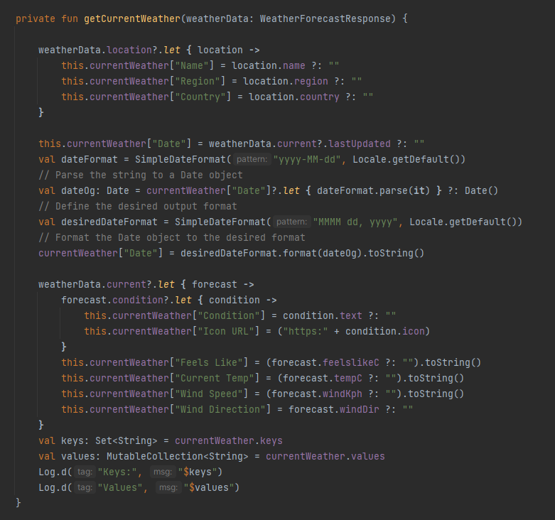

The above screenshot documents the function to get the current weather data from the API response
and store it in a MutableMap of Strings (called currentWeather). The same is done for the forecast data
but is then stored in a mutable list of mutable maps of Strings.

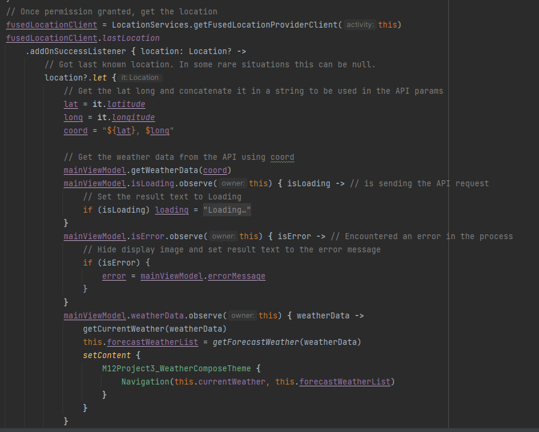

The above screenshot is showing part of the onCreate method which accesses the location of the user, 
gets the latitude and longitude, concatenates these values into a String of coordinates to be supplied
to the API URL via the mainViewModel object's getWeatherData function. The mainViewModel then uses
the observe function to access LiveData(aka the weatherData) and supply it to the getCurrentWeather
and getForecastWeather functions. Once the data is retrieved, the Navigation function is called
to set up the UI and supply it with the data it needs to present to the user.
