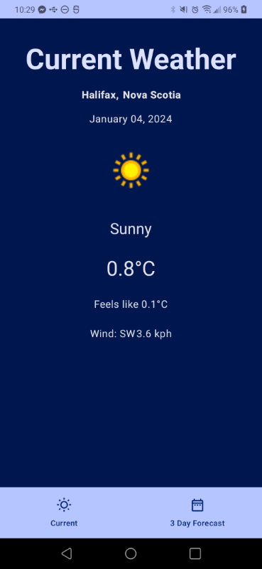

> **Completed for MOBI3002: Mobile Application Development Final Project**
>
> Lauren MacDonald, December 2023
>
> **Languages/Concepts**: Kotlin, Compose, RESTful API

## Application
### Light Screenshots

### Dark Screenshots

This app was built using Kotlin, Compose in Android Studio. weatherapi.com is used to pull weather 
data for the current forecast and 3 day forecast. The ROBOPOJO plugin was used, along with the
RetroFit library to handle the API request. Navigation Controller is used to navigate between the two
screens in the app.
